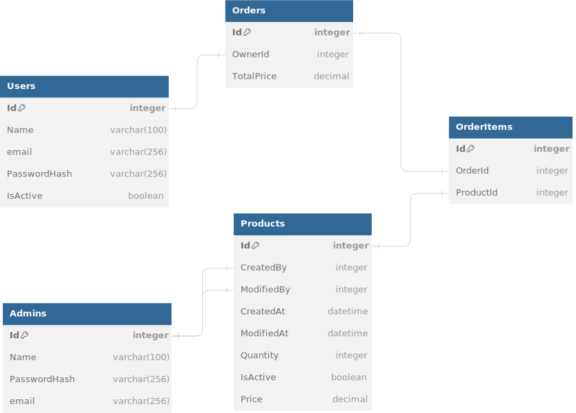

# Asset Management System

The Asset Management System is a web-based application designed to help organizations efficiently manage their assets, track inventory, and streamline the process of asset allocation and tracking.

## Features

- **User Management:**
  - Register and manage user accounts.
  - Differentiate between regular users and administrators.

- **Admin Management:**
  - Admins can oversee and manage user accounts.
  - Admins have special privileges for managing products and orders.

- **Product Management:**
  - Add, edit, and deactivate products.
  - Track product details such as quantity, price, and status.
  - Record the creator and modifier of each product.

- **Order Management:**
  - Users can place orders for products.
  - Admins can view and manage orders.
  - Track order details, including owner, total price, and order items.

- **Order Items:**
  - Associate products with orders.
  - View detailed information about each order item.

## Technologies Used

- **Frontend:**
  - HTML, CSS, JavaScript
  - Frontend Framework (e.g., React, Angular, Vue)

- **Backend:**
  - Server-side language (e.g., Node.js, Django, Flask, Spring Boot)
  - Database (e.g., MySQL, PostgreSQL, MongoDB)

- **Version Control:**
  - Git, GitHub

## DB Diagram


## Getting Started

1. Clone the repository:

   ```bash
   git clone https://github.com/ddas09/dotnet-microservices.git
